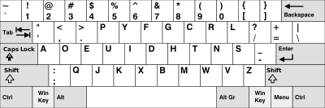

# 1.1 Keyboard Fundamentals

A keyboard is an arrangement of keys that when pressed or tapped, sends a `key code` to a keyboard driver. `Key codes` are all the keys like Alphanumeric(a, b, 1, 2), modifier(ctrl, alt/option), arrow keys and many more. All these keys form a `keyboard layout` that represents a collection of keys and their position. There are some common layouts that even have names such as qwerty, colemak, and dvorak that are shown below.

.png>)

.png>)

The purpose of a keyboard is to be an input device to communicate information to your computer. If a key outputs a single code, then there would be a one-to-one relationship, where each key gets a single keycode output. This is quite impractical and would require lots of rows and keys like in the picture below.

A key can instead have a one-to-many relationship with the help of `Activators.` Activators are the keycodes like the shift and capslock keys.  When the shift activators is activated they switch output from lowercase letters to upper case letters. This creates a one-to-two relationship, where one key can have 2 possible output states, lower and upper. When talking about just the lowercase keys or uppercase keys on the layout, we instead give call it a \`layer\` followed by a description word. So the starting layout is made of 2 layers, the default layer or base layer containing lower case keys and the upper, shift or caps layer containing the uppercase letters .

There are many more keyboard layers, such as the function layer(Fn), number layer and navigation layer that will be discussed later. Together, all these keyboard layers can be grouped together to create a \`keymap\`. A Keymap is useful if you move between keyboards or share all the layers at once.
