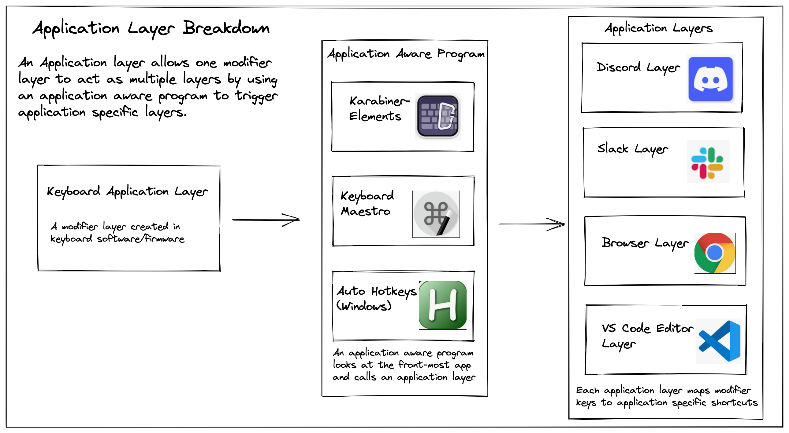

# 5.5 Categorizing Layers

Layers can be categorized into 3 types; Root, Application and System layers.

### Root Layer

The root layers is the starting point to get to most other layers. This is typically the [default layer](../ch-6-layer-examples/layers/default-layer.md) but can also be a [gaming layer](../ch-6-layer-examples/layers/gaming-layer.md) that has additional game specific layers. In the root layer, you want to be able to easily access all other layers.

### Application Layers



An application layer allows one [modifier layer](../ch-3-layer-activators/3.1-modifier-layers.md) to act as multiple layers by using an application aware program to trigger application specific layers. The diagram first shows on the left column a modifier layer like a hyperkey layer created from keyboard specific software/firmware.&#x20;

In the middle middle is an application aware program that looks at the front-most application and calls an application layer. An application aware programs includes Karabiner-Elements, Keyboard Maestro and Auto Hotkeys. There can only be 1 front-most application at any time, meaning only a single modifier layer activator is needed to trigger as many applications layers that are defined.

The right column are application layers. Application layers have application specific hotkeys or macros such as a [VS code](../ch-6-layer-examples/layers/vs-code-layer.md), [discord](../ch-6-layer-examples/layers/discord-layer.md), [slack](../ch-6-layer-examples/layers/slack-layer.md) and a [browser](../ch-6-layer-examples/layers/browser-layer.md). The Application aware program acts as a giant switch case with multiple conditions, and when triggered will activate the application layer.

A hyper layer is a modifier layer that consist of all keys having a shift+ctrl+option+command + original qwerty key. This however won't work practically for all keys though for couple reasons:

1. Keys like caps, modifiers or thumb keys need a different key
2. Mac has a sysdiagnose hotkey on the hyper , . keys.
3. Applications don't trigger when certain pairing are held.

For these reasons, the application layer does not look as cleanly as I would like. I created an application layer for my keyboard using F1-24 keys&#x20;


```
{
    "manipulators": [
        {
            "conditions": [
                {
                    "bundle_identifiers": [
                        "^com\\.google\\.Chrome"
                    ],
                    "type": "frontmost_application_if"
                }
            ],
            "description": "Chrome vimium scroll to bot",
            "from": {
                "key_code": "k",
                "modifiers": {
                    "mandatory": [
                        "shift",
                        "command",
                        "option",
                        "control"
                    ]
                }
            },
            "to": [
                {
                    "key_code": "k",
                    "modifiers": [
                        "control"
                    ]
                }
            ],
            "type": "basic"
        }
    ]
},
{
    "manipulators": [
        {
            "conditions": [
                {
                    "bundle_identifiers": [
                        "^com\\.hnc\\.Discord"
                    ],
                    "type": "frontmost_application_if"
                }
            ],
            "description": "Discord channel down",
            "from": {
                "key_code": "k",
                "modifiers": {
                    "mandatory": [
                        "shift",
                        "command",
                        "option",
                        "control"
                    ]
                }
            },
            "to": [
                {
                    "key_code": "down_arrow",
                    "modifiers": [
                        "option"
                    ]
                }
            ],
            "type": "basic"
        }
    ]
},
{
    "manipulators": [
        {
            "conditions": [
                {
                    "bundle_identifiers": [
                        "^com\\.tinyspeck\\.slackmacgap"
                    ],
                    "type": "frontmost_application_if"
                }
            ],
            "description": "slack jump to a conversation",
            "from": {
                "key_code": "k",
                "modifiers": {
                    "mandatory": [
                        "shift",
                        "command",
                        "option",
                        "control"
                    ]
                }
            },
            "to": [
                {
                    "key_code": "k",
                    "modifiers": [
                        "command"
                    ]
                }
            ],
            "type": "basic"
        }
    ]
},

```

Notice how each "from" key is hyper+k key in the karabiner-elements snippet above. Then each condition has a different "bundle\_identifiers" that look for specific programs. And finally, the "to" is mapped to a hotkey for the application.

### System Layers

System layers are layers that you will want to access within any application. They require a dedicated layer and should not be made into an application layer because you would want to use a system layer while another application layer is in front.

Some examples of system layers are [shift](../ch-6-layer-examples/layers/shift-layer.md),[ numpad](../ch-6-layer-examples/layers/numpad-layer.md), [media](../ch-6-layer-examples/layers/media-layer.md), [mouse](../ch-6-layer-examples/layers/mouse-layer.md) and [screen manipulation](../ch-6-layer-examples/layers/screen-management-layer.md) layers
